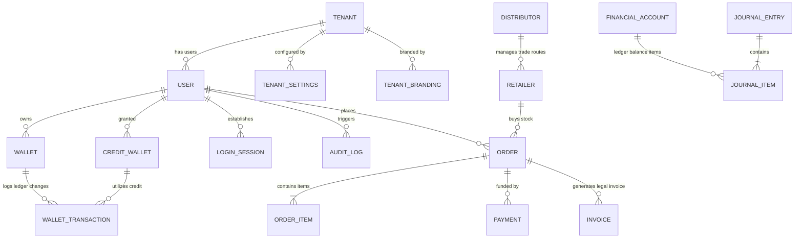

# SURYA CREDIT SOLUTIONS: DATABASE & SCHEMA DOCUMENTATION

This document provides a highly detailed, comprehensive audit of the **PostgreSQL Relational Ledger Schema** defined via Prisma inside `schema.prisma`. It details tables, core relations, keys, indexes, and referential constraints.

---

## 1. DATABASE ENTITY RELATIONSHIP (ER) DIAGRAM

The physical relationships between critical transactional tables are mapped below:



---

## 2. COMPREHENSIVE TABLE SCHEMAS

Below is the complete database dictionary mapping columns, types, indexes, and relational rules.

### 2.1 Table: `User`
- **Purpose**: Stores authentication profiles, secure credentials, and physical contact data for all administrators, partners, and retailer classes.

| Column | Data Type | Modifiers | Description |
| :--- | :--- | :--- | :--- |
| `id` | `VARCHAR(191)` | `PRIMARY KEY`, `DEFAULT uuid()` | Cryptographically secure unique identifier. |
| `email` | `VARCHAR(191)` | `UNIQUE`, `NOT NULL` | User email address. |
| `password` | `VARCHAR(191)` | `NOT NULL` | Bcrypt-hashed secure login password. |
| `name` | `VARCHAR(191)` | `NOT NULL` | User's full name. |
| `mpin` | `VARCHAR(191)` | `NULL` | Encrypted 4-digit mobile transaction authorization PIN. |
| `role` | `ENUM` | `NOT NULL`, `DEFAULT RETAILER` | Tier access level (SUPER_ADMIN, DISTRIBUTOR, RETAILER, etc). |
| `isActive` | `BOOLEAN` | `DEFAULT TRUE` | Status flag for access lockout systems. |
| `createdAt` | `TIMESTAMP` | `DEFAULT CURRENT_TIMESTAMP` | Profile creation time. |
| `updatedAt` | `TIMESTAMP` | `DEFAULT CURRENT_TIMESTAMP` | Profile update time. |

---

### 2.2 Table: `Wallet`
- **Purpose**: Tracks real-time cash ledger accounts and transaction buffers for standard merchant trade routes.

| Column | Data Type | Modifiers | Description |
| :--- | :--- | :--- | :--- |
| `id` | `VARCHAR(191)` | `PRIMARY KEY`, `DEFAULT uuid()` | Unique identifier. |
| `userId` | `VARCHAR(191)` | `NOT NULL`, `FOREIGN KEY` | Reference to `User.id` (Cascading Restrict). |
| `balance` | `DECIMAL(18,2)` | `NOT NULL`, `DEFAULT 0.00` | Instantly withdrawable trade balance. |
| `frozen` | `DECIMAL(18,2)` | `NOT NULL`, `DEFAULT 0.00` | Escrow / Held funds balance. |
| `currency` | `VARCHAR(10)` | `NOT NULL`, `DEFAULT 'INR'` | Transaction legal tender context. |

- **Indexes**:
  - `idx_wallet_user_currency` on (`userId`, `currency`).

---

### 2.3 Table: `CreditWallet`
- **Purpose**: Manages institutional distributor-backed credit loops and dynamic credit-limit pools.

| Column | Data Type | Modifiers | Description |
| :--- | :--- | :--- | :--- |
| `id` | `VARCHAR(191)` | `PRIMARY KEY`, `DEFAULT uuid()` | Unique identifier. |
| `userId` | `VARCHAR(191)` | `NOT NULL`, `FOREIGN KEY` | Reference to `User.id`. |
| `limit` | `DECIMAL(18,2)` | `NOT NULL` | Max credit line allowed (INR). |
| `utilized` | `DECIMAL(18,2)` | `NOT NULL`, `DEFAULT 0.00` | Currently spent credit balance. |
| `interestRate`| `DECIMAL(5,2)` | `NOT NULL`, `DEFAULT 18.00` | APY compounding trade interest. |

---

### 2.4 Table: `WalletTransaction`
- **Purpose**: Ledger containing atomic transaction line items for standard cash or credit wallets.

| Column | Data Type | Modifiers | Description |
| :--- | :--- | :--- | :--- |
| `id` | `VARCHAR(191)` | `PRIMARY KEY` | Unique transaction ID (`txn_pay_xxxxx`). |
| `walletId` | `VARCHAR(191)` | `NOT NULL`, `FOREIGN KEY` | Reference to target `Wallet.id`. |
| `amount` | `DECIMAL(18,2)` | `NOT NULL` | Absolute transaction magnitude. |
| `type` | `ENUM` | `NOT NULL` | `DEBIT` or `CREDIT`. |
| `channel` | `ENUM` | `NOT NULL` | `WALLET`, `CREDIT_LINE`, `AEPS`, `DMT`, `UPI_QR`. |
| `status` | `ENUM` | `NOT NULL` | `SUCCESSFUL`, `PENDING`, `FAILED`, `REFUNDED`. |
| `createdAt` | `TIMESTAMP` | `DEFAULT CURRENT_TIMESTAMP` | Transaction execution time. |

---

### 2.5 Table: `Order`
- **Purpose**: Stores sales pipelines and marketplace purchases made by merchants.

| Column | Data Type | Modifiers | Description |
| :--- | :--- | :--- | :--- |
| `id` | `VARCHAR(191)` | `PRIMARY KEY` | Unique marketplace order reference. |
| `userId` | `VARCHAR(191)` | `NOT NULL`, `FOREIGN KEY` | Reference to the purchaser (`User.id`). |
| `totalAmount`| `DECIMAL(18,2)` | `NOT NULL` | Cumulative purchase price including tax. |
| `status` | `ENUM` | `NOT NULL`, `DEFAULT PENDING` | `PENDING`, `SHIPPED`, `DELIVERED`, `CANCELLED`. |
| `createdAt` | `TIMESTAMP` | `DEFAULT CURRENT_TIMESTAMP` | Order timestamp. |

---

### 2.6 Table: `JournalItem`
- **Purpose**: Ledger balance records mapping exact transactional entries within double-entry accounting files.

| Column | Data Type | Modifiers | Description |
| :--- | :--- | :--- | :--- |
| `id` | `VARCHAR(191)` | `PRIMARY KEY`, `DEFAULT uuid()` | Unique item entry ID. |
| `journalEntryId`| `VARCHAR(191)`| `NOT NULL`, `FOREIGN KEY`| Parent ledger ticket (`JournalEntry.id`). |
| `accountId` | `VARCHAR(191)` | `NOT NULL`, `FOREIGN KEY` | Core Chart of Account reference. |
| `debit` | `DECIMAL(18,2)` | `NOT NULL`, `DEFAULT 0.00` | Debit balance. |
| `credit` | `DECIMAL(18,2)` | `NOT NULL`, `DEFAULT 0.00` | Credit balance. |

- **Verification Constraints**:
  - Double-entry balance rule requires that for every `JournalEntry`, `SUM(debit) == SUM(credit)`.

---

### 2.7 Table: `AuditLog`
- **Purpose**: Immutable security and administrative log storage.

| Column | Data Type | Modifiers | Description |
| :--- | :--- | :--- | :--- |
| `id` | `VARCHAR(191)` | `PRIMARY KEY`, `DEFAULT uuid()` | Unique log sequence identifier. |
| `tenantId` | `VARCHAR(191)` | `NOT NULL` | Target isolated workspace identifier. |
| `userId` | `VARCHAR(191)` | `NOT NULL` | Authoring administrator/agent identifier. |
| `action` | `VARCHAR(191)` | `NOT NULL` | Action code (e.g. `MPIN_CHANGED`, `CREDIT_LINE_EXTENDED`). |
| `entity` | `VARCHAR(191)` | `NOT NULL` | Target entity table (e.g. `User`, `Wallet`). |
| `entityId` | `VARCHAR(191)` | `NOT NULL` | ID of modified entity. |
| `oldValue` | `TEXT` | `NULL` | JSON structure representing previous state. |
| `newValue` | `TEXT` | `NULL` | JSON structure representing updated state. |
| `ipAddress` | `VARCHAR(45)` | `NOT NULL` | Origin IPv4 / IPv6 client address. |
| `createdAt` | `TIMESTAMP` | `DEFAULT CURRENT_TIMESTAMP` | Log record entry time. |

---

## 3. DATABASE MIGRATION HISTORY

Database migrations are executed deterministically using **Prisma Migrate**:

```bash
# Production Migration Flow
npx prisma migrate deploy
```

- **Initial Base Migration**: Generated relational base structures and mapped core security tables (`User`, `Wallet`, `CreditWallet`, `KycDocument`).
- **Feature Layer Migration**: Integrated marketplace, double-entry bookkeeping ledgers (`FinancialAccount`, `JournalEntry`, `JournalItem`), and custom GST invoicing schema structures.
- **SaaS Isolation Layer**: Patched tables with `tenantId` parameters, establishing unique composite primary keys and unique indices for secure subdomain resolution.
- **Support Duplicate Correction**: Realigned colliding support definitions under `SimpleSupportTicket` for non-SaaS operations and `SupportTicket` for high-throughput tenant operations.
