# Surya Credit B2B FinTech Network: Database ER-Diagram & Relational Core Architecture

This document maps the production relational schema, indexing guidelines, and enterprise relationships for the Surya Credit multi-tenant ledger and supply platform built on **PostgreSQL**.

---

## 1. High-Fidelity Entity-Relationship (ER) Diagram (Mermaid)

Below is the complete database entity graph depicting how retail nodes, master ledger, and payment integrations intersect:

```mermaid
erDiagram
    USER {
        string id PK
        string email UK
        string phoneNumber UK
        string passwordHash
        string fullName
        enum role "SUPER_DISTRIBUTOR, DISTRIBUTOR, RETAILER, EMPLOYEE, ADMIN"
        boolean isActive
        string parentId FK
        string googleId
        string microsoftId
    }

    DISTRIBUTOR {
        string id PK
        string userId FK "1:1 with User"
        string gstNumber UK
        string region
        string tier
    }

    RETAILER {
        string id PK
        string userId FK "1:1 with User"
        string shopName
        double latitude
        double longitude
        boolean isKioskActive
    }

    EMPLOYEE {
        string id PK
        string userId FK "1:1 with User"
        string department
        string designation
    }

    WALLET {
        string id PK
        string userId FK "1:1 with User"
        decimal balance "15,2"
        decimal commissionEarned "15,2"
        decimal cashbackEarned "15,2"
    }

    CREDIT_WALLET {
        string id PK
        string userId FK "1:1 with User"
        decimal creditLimit "15,2"
        decimal usedCredit "15,2"
        decimal interestRate "5,2"
        int repaymentCycle
        boolean isActive
    }

    CREDIT_LIMIT {
        string id PK
        string creditWalletId FK
        decimal previousLimit
        decimal newLimit
        string updatedBy
        string reason
    }

    WALLET_TRANSACTION {
        string id PK
        string walletId FK
        enum type "CREDIT, DEBIT, COMMISSION, CASHBACK"
        enum service "RECHARGE, BBPS, AEPS, DMT, CREDIT_PAY, QR_PAY, ORDER"
        decimal amount "15,2"
        string status
        string referenceId UK "Bank RRN / Hash"
        string paymentMethod
        decimal cgst
        decimal sgst
        decimal commissionAmt
    }

    CATEGORY {
        string id PK
        string name UK
        string description
    }

    PRODUCT {
        string id PK
        string categoryId FK
        string name
        string sku UK
        decimal price
        int gstRate
        string vendorId FK
    }

    INVENTORY {
        string id PK
        string productId FK "1:1 with Product"
        int stockCount
        string warehouseLocation
        int reorderPoint
    }

    VENDOR {
        string id PK
        string name UK
        string email UK
        string phoneNumber UK
        string address
    }

    ORDER {
        string id PK
        string buyerId FK
        decimal totalAmount
        enum status "PENDING, PROCESSING, SHIPPED, DELIVERED"
        string paymentMethod
    }

    ORDER_ITEM {
        string id PK
        string orderId FK
        string productId FK
        decimal unitPrice
        int quantity
        int gstRate
    }

    PAYMENT {
        string id PK
        decimal amount
        string gateway "RAZORPAY, CASHFREE, PINELABS, CCAVENUE, PAYTM, ZAAKPAY"
        string gatewayTxnId UK
        string status
        string orderId FK
        string transactionId FK
    }

    PAYMENT_LOG {
        string id PK
        string paymentId FK
        string event
        text rawPayload
    }

    KYC_DOCUMENT {
        string id PK
        string userId FK "1:1 with User"
        string businessName
        string panNumber UK
        string gstNumber UK
        string aadhaarNumber
        enum status "PENDING, SUBMITTED, APPROVED, REJECTED"
    }

    INVOICE {
        string id PK
        string invoiceNumber UK
        string orderId FK "1:1 with Order"
        string transactionId FK "1:1 with WalletTransaction"
        decimal taxableAmount
        decimal cgstAmount
        decimal sgstAmount
        decimal igstAmount
        decimal totalAmount
    }

    GST_RECORD {
        string id PK
        string invoiceId FK
        string gstin
        int rate
        decimal cgst
        decimal sgst
        decimal igst
        string status "UNFILED, FILED, AUDITED"
    }

    COMMISSION {
        string id PK
        enum serviceType
        enum agentRole
        decimal slabMin
        decimal slabMax
        decimal percentComm
        decimal flatComm
    }

    SETTLEMENT {
        string id PK
        string beneficiaryName
        string bankName
        string accountNumber
        string ifscCode
        decimal amount
        string status
        string referenceId UK
    }

    SUPPORT_TICKET {
        string id PK
        string userId FK
        string employeeId FK
        string subject
        string status "OPEN, RESOLVED"
        string priority
    }

    NOTIFICATION {
        string id PK
        string userId FK
        string title
        string message
        boolean isRead
    }

    AUDIT_LOG {
        string id PK
        string userId FK
        string action
        string ipAddress
        text metadata
    }

    %% Relationship lines
    USER ||--o{ USER : "Multi-Tenant Hierarchy (Parent-Child)"
    USER ||--|| WALLET : "Has Wallet"
    USER ||--|| CREDIT_WALLET : "Has Credit Line"
    USER ||--|| KYC_DOCUMENT : "Submits KYC"
    USER ||--|| DISTRIBUTOR : "Distributor Profile"
    USER ||--|| RETAILER : "Retailer Profile"
    USER ||--|| EMPLOYEE : "Employee Profile"
    USER ||--o{ ORDER : "Places Procurement Orders"
    USER ||--o{ SUPPORT_TICKET : "Raises Tickets"
    USER ||--o{ NOTIFICATION : "Receives"
    USER ||--o{ AUDIT_LOG : "Performs Action"

    CREDIT_WALLET ||--o{ CREDIT_LIMIT : "Alters Limits History"
    WALLET ||--o{ WALLET_TRANSACTION : "Generates Double-Entry Ledger"
    WALLET_TRANSACTION ||--|| INVOICE : "Generates Fee Invoice"
    WALLET_TRANSACTION ||--o{ PAYMENT : "Funded by Payment Gateway"

    CATEGORY ||--o{ PRODUCT : "Classifies"
    PRODUCT ||--|| INVENTORY : "Maintains Stock"
    VENDOR ||--o{ PRODUCT : "Supplies Device"
    ORDER ||--o{ ORDER_ITEM : "Contains Items"
    PRODUCT ||--o{ ORDER_ITEM : "Included in"
    ORDER ||--|| INVOICE : "Generates Procurement Invoice"
    ORDER ||--o{ PAYMENT : "Settled by Payments"

    PAYMENT ||--o{ PAYMENT_LOG : "Creates Status logs"
    INVOICE ||--o{ GST_RECORD : "Generates GST filings"
```

---

## 2. Core PostgreSQL Relationships

1. **Hierarchy (Parent-Child Partner Link)**:
   - Self-referencing link in `User` using `parentId`. Maps a `RETAILER` kiosk to a local `DISTRIBUTOR`, and a `DISTRIBUTOR` to a dynamic `SUPER_DISTRIBUTOR`.

2. **Ledger Double-Entry Bookkeeping**:
   - Every credit, debit, or commission payout is tied to a single user `Wallet` via `WalletTransaction`. 

3. **Invoicing & Taxes (GST Core)**:
   - Every order or premium monetary transaction maps to an `Invoice` with an exact itemized split of Central GST (CGST) and State GST (SGST), feeding directly into the `GstRecord` compliance board.

---

## 3. Recommended PostgreSQL Indexing Optimization

To sustain under 10ms query times at scale, we enforce the following indexing design patterns:

| Index Name | Target Table | Target Column(s) | Index Type | Business Justification |
|------------|--------------|------------------|------------|------------------------|
| `idx_user_role` | `User` | `role` | `BTREE` | Fast multi-tenant partition lookups. |
| `idx_wallet_txn_ref` | `WalletTransaction` | `referenceId` | `UNIQUE HASH` | Instant duplicate deposit webhook verification. |
| `idx_payment_gw_txn` | `Payment` | `gatewayTxnId` | `UNIQUE BTREE` | Real-time transaction reconciliation lookup. |
| `idx_order_buyer` | `Order` | `buyerId` | `BTREE` | Speed up merchant purchase histories. |
| `idx_audit_user_action` | `AuditLog` | `userId, action` | `COMPOSITE BTREE` | Fast enterprise compliance audit trails. |
| `idx_retailer_coords` | `Retailer` | `latitude, longitude` | `SPATIAL GIST` | Google Maps geo-spatial kiosk proximity searches. |
