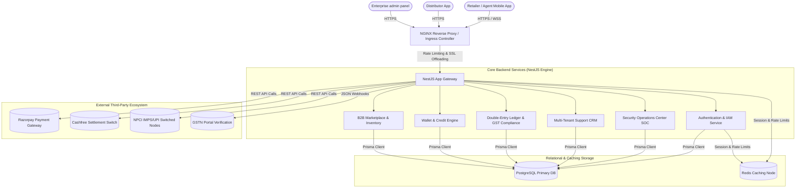
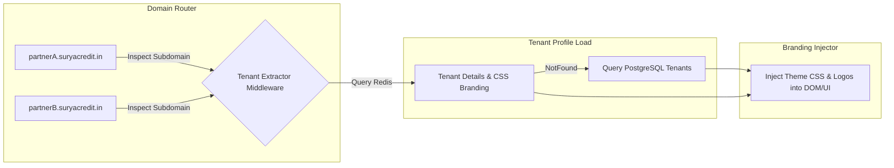
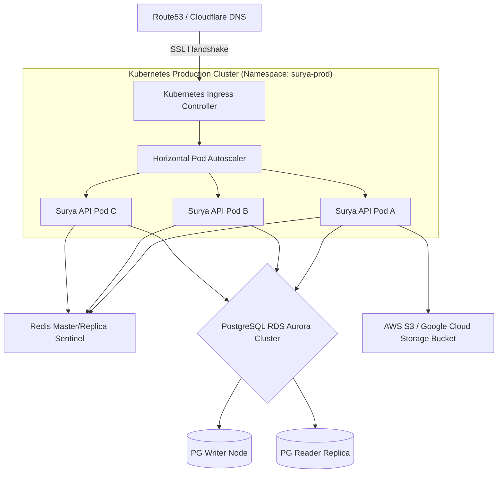

# SURYA CREDIT SOLUTIONS: SYSTEM ARCHITECTURE DOCUMENT

This document outlines the complete architectural blueprints, data flow diagrams, security topologies, and structural boundaries of the **Surya Credit Solutions** platform.

---

## 1. HIGH-LEVEL ARCHITECTURE (SYSTEM CONTEXT)

Surya Credit Solutions is a multi-tenant, high-throughput B2B Fintech and trade facilitation platform. The system coordinates interactions between mobile agents, regional distributors, administrators, core ledger systems, and public utility API switches.



---

## 2. LOW-LEVEL MICROSERVICES ARCHITECTURE

The backend application is designed using a clean, domain-driven modular structure inside the NestJS framework.

```
                  ┌───────────────────────────────┐
                  │      Incoming HTTP Request    │
                  └───────────────┬───────────────┘
                                  ▼
                  ┌───────────────────────────────┐
                  │    Correlation ID Middleware  │ (Injects X-Correlation-ID header)
                  └───────────────┬───────────────┘
                                  ▼
                  ┌───────────────────────────────┐
                  │     Global Rate Limiter Guard │ (Redis-backed Throttling)
                  └───────────────┬───────────────┘
                                  ▼
                  ┌───────────────────────────────┐
                  │    JWT/MFA Guard & RBAC Guard │ (Role & Tenant Validation)
                  └───────────────┬───────────────┘
                                  ▼
                  ┌───────────────────────────────┐
                  │   Controller Route Handler    │ (DTO & Class Validation)
                  └───────────────┬───────────────┘
                                  ▼
                  ┌───────────────────────────────┐
                  │      Business Domain Service  │ (Transactional Boundaries)
                  └───────────────┬───────────────┘
                                  ▼
                  ┌───────────────────────────────┐
                  │      Prisma Client ORM        │ (Type-Safe Database Query)
                  └───────────────────────────────┘
```

### 2.1 Microservices Boundaries
1. **Authentication (IAM)**: Governs user lifecycles, OAuth2 sign-on sessions, hardware device bindings, and security-critical MPIN state validation.
2. **Wallet & Credit Lines**: High-concurrency wallet ledger ledger processing featuring atomic transaction locks, real-time balances, and distributor credit-line utilization.
3. **Marketplace & Inventory**: Direct-to-retailer catalog system allowing wholesale orders, distributor stock fulfillment, and dynamic supplier pricing.
4. **Finance & GST Ledger**: Enforces a strict double-entry ledger bookkeeping strategy, logging automatic GST/CGST splits and generating Government-compliant GstInvoices.
5. **Support Ticket Engine**: Multi-tenant service desk routing support tickets between agents, franchise supervisors, and the central helpdesk.

---

## 3. FRONTEND ARCHITECTURE (FLUTTER CLIENT)

The primary mobile and web client leverages a reactive, state-bound architectural pattern using Provider state models, secure client storage, and local SQLite data caching.

```
 ┌─────────────────────────────────────────────────────────────┐
 │                       UI Views (Compose/Flutter)             │
 └──────────────────────────────┬──────────────────────────────┘
                                ▲
                                │ (State Updates & Rebuilds)
                                ▼
 ┌─────────────────────────────────────────────────────────────┐
 │                  State Management Providers                  │
 └──────────────────────────────┬──────────────────────────────┘
                                ▲
                                │ (Action Triggers & API Calls)
                                ▼
 ┌──────────────────────────────┴──────────────────────────────┐
 │                    HTTP Services (Retrofit)                 │
 └──────┬──────────────────────────────────────────────┬───────┘
        │ (Online Web Requests)                        │ (Offline Operations)
        ▼                                              ▼
 ┌──────────────┐                               ┌──────────────┐
 │ NestJS APIs  │                               │ SQLite Cache │
 └──────────────┘                               └──────────────┘
```

### 3.1 Architectural Pillars
- **Edge-to-Edge Responsive Layouts**: Automatically adjusts dense list-views and data-grids dynamically between small compact mobile views and extended administrator screens.
- **Biometric Hardware Integrations**: Interfaces with device secure hardware (Secure Enclave / Android Keystore) to safely prompt fingerprint verification during transactions.
- **Offline Mode Fallbacks**: Logs outbound transaction requests locally inside SQLite if connectivity drops, auto-flushing them once network connectivity is restored.

---

## 4. MULTI-TENANT & WHITE-LABEL ARCHITECTURE

Surya Credit Solutions incorporates a robust shared-database, tenant-segregated schema model.



### 4.1 Tenant Isolation Levels
1. **Database-Level Isolation**: Every transactional table contains a mandatory `tenantId` foreign-key column. Global Prisma queries automatically append `.findMany({ where: { tenantId } })` to prevent cross-tenant leaks.
2. **Whitelabel Domain Mapping**: Supports CNAME dns records dynamically mapping client portals (e.g. `pay.partnerbrand.com`) to the central app-gateway without code modifications.
3. **Dynamic Custom UI Styles**: Loads custom CSS palettes, branding assets, custom layouts, and merchant logos from the database on tenant handshake to completely customize the user experience.

---

## 5. SECURITY ARCHITECTURE (CYBER-SECURITY MATRIX)

The platform is secured at all layers, utilizing modern cryptographic algorithms, transit-level encryption, and active security scanning controls.

```
 [User Client Interface]
          │
      TLS 1.3 (Forced Cryptographic Transport)
          │
          ▼
 [NGINX Hardened Ingress Proxy] (SSL Offloading, WAF Regex Injection filter, HSTS)
          │
          ▼
 [Rate-Limiting Middleware] (Redis Token-Bucket, Blocks IPs exceeding threshold)
          │
          ▼
 [JWT Authentication Guard] (Verifies Signature, Handshake JWT Expiry)
          │
          ▼
 [RBAC Security Handler] (Verifies Action against 13-Tier Role Matrix)
          │
          ▼
 [Prisma Parameterized Query Engine] (Eliminates SQL injection risk completely)
          │
          ▼
 [Immutable Database Audit Log] (Writes write-action parameters to disk)
```

### 5.1 High-Performance Security Measures
- **Dual-Layer JWT Signatures**: Short-lived (30 min) access tokens paired with secure, HTTP-only refresh tokens (8 hour) stored in Redis database caches.
- **Biometric Device Binding**: Pins a unique hardware-generated device fingerprint (`DeviceId`) to user profiles. Logins originating from unrecognized devices trigger mandatory OTP/Email checks.
- **Read-Only Database Audit Logging**: Logs sensitive administrative transactions permanently inside the `AuditLog` table using schema-level database write locks.

---

## 6. DEPLOYMENT & COMPONENT TOPOLOGY

Production infrastructure is orchestrated natively inside an AWS/GCP Elastic Kubernetes Cluster (EKS/GKE) ensuring scalable, fault-tolerant operations.



### 6.1 Autoscaling Thresholds
- **Horizontal Pod Autoscaling (HPA)**: Automatically scales NestJS application pods from `3` to `30` replicas if CPU utilization exceeds **70%** or RAM allocation passes **75%** over a 3-minute evaluation sliding window.
- **Failover Routing Policies**: Health check probes (`/health/liveness`, `/health/readiness`) run every 10 seconds. Pods failing 3 consecutive probes are instantly isolated and re-created automatically.
